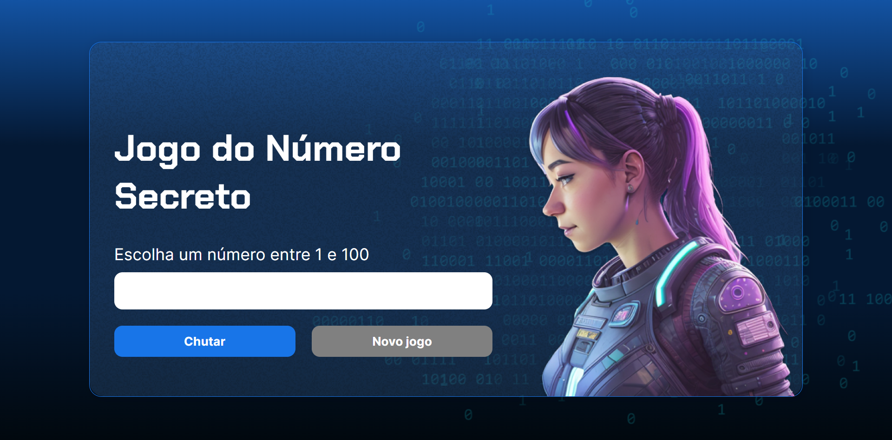

# Jogo do Número Secreto em JavaScript

Projeto desenvolvido no Curso de Lógica de programação, fornecido pela Alura.

Este é um jogo de adivinhação de números onde o jogador tenta adivinhar um número secreto entre 1 e 100. 

Abaixo está uma explicação de como o código está estruturado:

## Estrutura HTML
- A estrutura HTML define a interface do jogo, com elementos como um campo de entrada para o chute, botões para verificar o chute e reiniciar o jogo, e áreas para exibir mensagens.

## Estilos CSS
- O CSS é responsável por fornecer a aparência visual do jogo, incluindo cores, fontes e layout.

## Funcionalidades JavaScript

### Variáveis
- `listaDeNumerosSorteados`: Armazena os números que já foram sorteados.
- `numeroLimite`: Define o limite máximo para o número secreto (no caso, de 1 a 100).
- `numeroSecreto`: Armazena o número que o jogador deve adivinhar, inicializado com um valor aleatório.
- `tentativas`: Armazena o número de tentativas do jogador, inicializado com 1.

### Funções
- `exibirTextoNaTela(tag, texto)`: Exibe um texto na tela e utiliza a biblioteca `responsiveVoice` para falar o texto em português.
- `exibirMensagemInicial()`: Exibe a mensagem inicial para o jogador escolher um número entre 1 e 100.
- `verificarChute()`: Verifica se o chute do jogador é correto e fornece feedback. Atualiza as mensagens na tela e contabiliza as tentativas.
- `gerarNumeroAleatorio()`: Gera um número aleatório dentro do limite definido, evitando repetições.
- `limparCampo()`: Limpa o campo de entrada onde o jogador digita o seu chute.
- `reiniciarJogo()`: Reinicia o jogo, gerando um novo número secreto, resetando as tentativas e exibindo a mensagem inicial.

## Como Jogar
1. Abra o jogo no navegador [Acesse o jogo aqui](https://jogo-ruddy-five.vercel.app/)
2. Um número aleatório entre 1 e 100 será escolhido como o número secreto.
3. Digite um número no campo de entrada e clique no botão "Chutar" para verificar o chute.
4. O jogo fornecerá feedback se o chute está muito alto ou muito baixo.
5. Continue a fazer chutes até acertar o número secreto.
6. Quando acertar, o jogo informará quantas tentativas foram necessárias e habilitará o botão "Novo Jogo" para reiniciar.

**Divirta-se jogando o Jogo do Número Secreto!**
